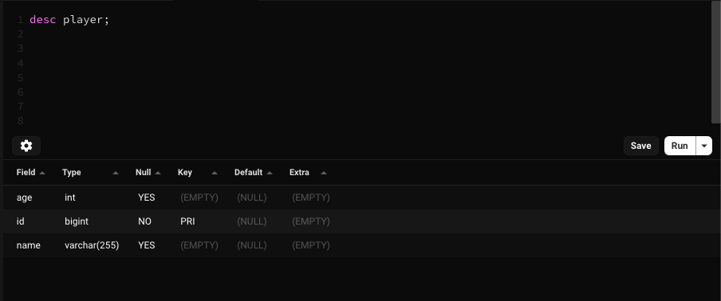
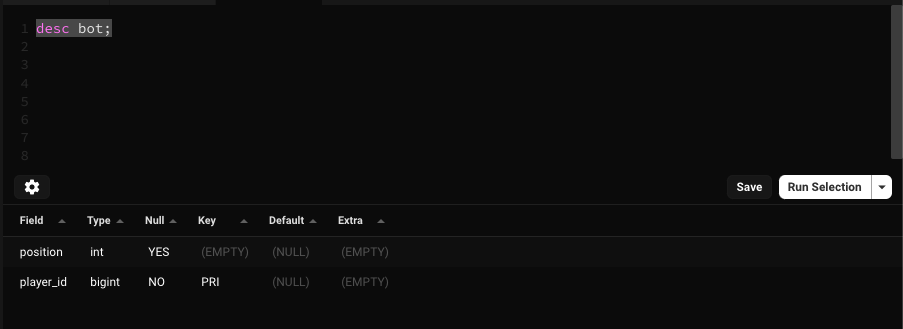

# Hibernate Inheritance Mapping
[Reference](https://www.baeldung.com/hibernate-inheritance)

## How to run
### Prerequisite
* Java 17
* Mysql or Docker

#### Docker
[Install Mysql on Docker](https://dev.mysql.com/doc/mysql-installation-excerpt/8.0/en/docker-mysql-getting-started.html)
* ```shell 
    docker pull container-registry.oracle.com/mysql/community-server:latest
  ```
* ```shell
    docker run --name=mysql --restart on-failure -p 3306:3306 -d container-registry.oracle.com/mysql/community-server:latest
  ```
* ```shell
    docker logs mysql1 2>&1 | grep GENERATED
  ```
* ```Note down the ROOT PASSWORD```
* ```shell
    docker exec -it mysql mysql -uroot -p
  ```
*  ```Enter the generated ROOT PASSWORD. You will get mysql prompt```
* ```Change the password of the root using the below command.```
* ```shell
    mysql> ALTER USER 'root'@'localhost' IDENTIFIED BY 'password';
  ```
* ```Create a database using below command.```
* ```shell
    mysql> create database hibernate_inheritance_mapping;
  ```
* ```Create a user using below command.```
* ```shell
    mysql> create user 'spring-boot'@'%' identified by 'ThePassword';
  ```
* ```Grant permission using below command.```
* ```shell
    mysql> grant all on hibernate_inheritance_mapping.* to 'spring-boot'@'%';
  ```
* Update the database password by updating the value of the property **spring.datasource.password** in application.properties file.

### Below properties for reference
```
spring:
  datasource:
    url: jdbc:mysql://${MYSQL_HOST:localhost}:3306/hibernate_inheritance_mapping
    username: spring-boot
    password: ${DB_PASSWORD:ThePassword}
    driver-class-name: com.mysql.cj.jdbc.Driver
  jpa:
    hibernate:
      ddl-auto: create-drop
    show-sql: true
```
_Note: you may want to change the value of ```spring.jpa.hibernate.ddl-auto```_


#### Player Table

#### Bot Table
